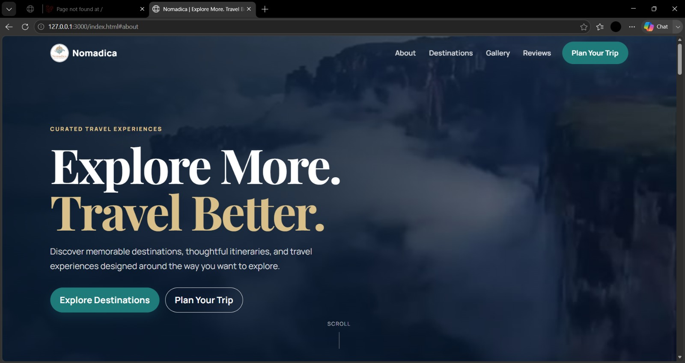
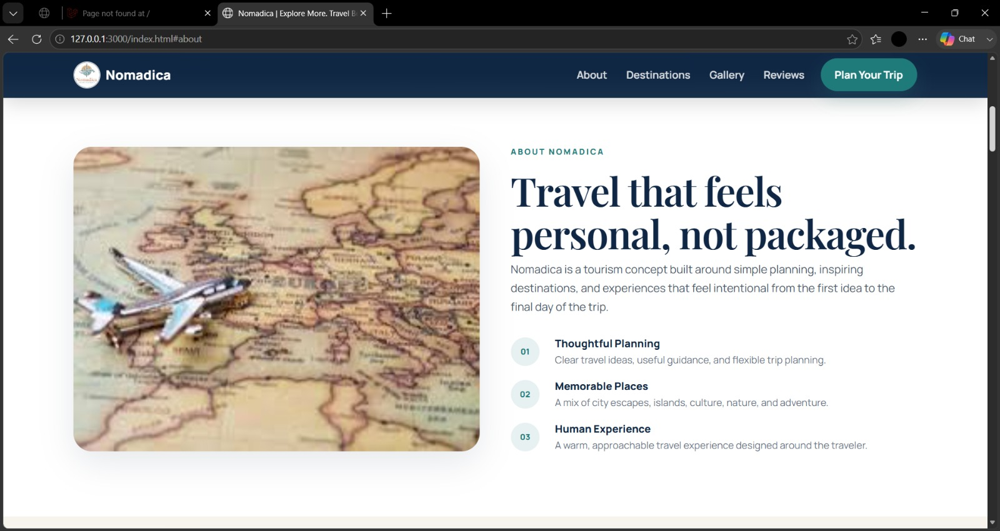
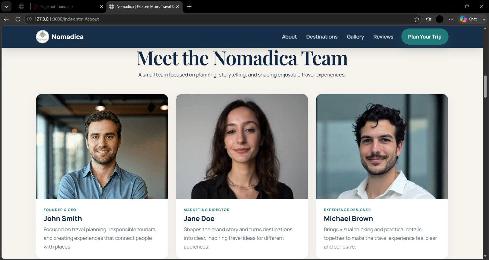
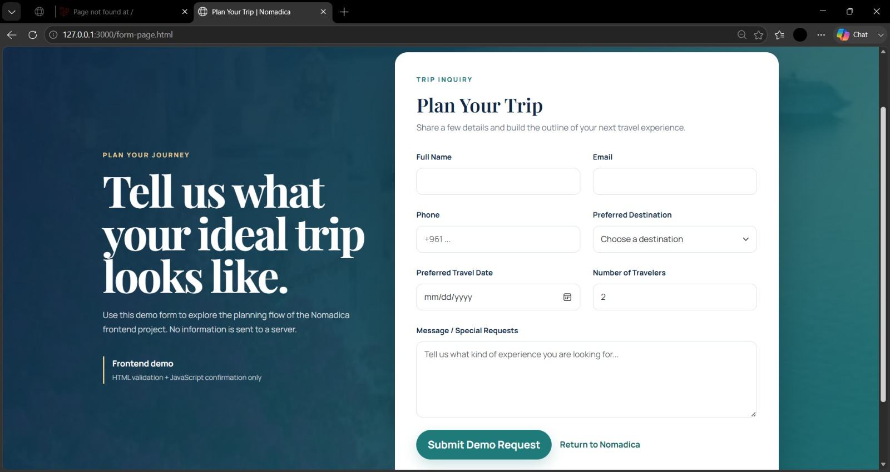

<div align="center">

# 🌍 Nomadica — Tourism Website

### Frontend Web Development Internship Training Project

**HTML5 • CSS3 • Bootstrap • JavaScript**

**Violet Programming — Software Company | Beirut–Tyre, Lebanon**  
**Supervisor:** Ms. Kawthar Muslimani — Full Stack Web Developer  
**Academic Year:** 2024–2025

</div>

---

## 📑 Table of Contents

- [Overview](#overview)
- [Internship Context](#internship-context)
- [My Contribution](#my-contribution)
- [Home & Hero](#home--hero)
- [About Nomadica](#about-nomadica)
- [Team Section](#team-section)
- [Destinations & Gallery](#destinations--gallery)
- [Plan Your Trip](#plan-your-trip)
- [Responsive Design](#responsive-design)
- [Technology Stack](#technology-stack)
- [Project Structure](#project-structure)
- [How to Run](#how-to-run)
- [Testing](#testing)
- [Learning Outcomes](#learning-outcomes)
- [Related Internship Project](#related-internship-project)
- [Acknowledgment](#acknowledgment)
- [Project Status](#project-status)
- [Author](#author)

---

## Overview

**Nomadica** is a tourism website created during **Level 1 — Frontend Development** of my web development training at **Violet Programming**.

The project focused on building and organizing a complete tourism interface using HTML, CSS, Bootstrap, and JavaScript. It includes a travel-focused landing page, destination content, an image gallery, team presentation, reviews, and a frontend trip-planning form.

This repository represents one of my earliest practical web-development projects and documents the frontend foundation I built before moving into PHP, MySQL, and introductory backend development.

---

## Internship Context

My web development training at **Violet Programming** was divided into two practical stages.

### Level 1 — Frontend Development

**Nomadica** represents the first stage of the training and focused on:

- HTML page structure
- CSS styling
- Bootstrap layouts and components
- JavaScript interactions
- Navigation
- Forms
- Responsive layout techniques
- Organizing a complete multi-section website

### Level 2 — Backend & Database Development

The second stage continued with **VP Courses**, where the training introduced:

- PHP
- MySQL
- CRUD operations
- Admin-side functionality
- Sessions
- Forms and image handling
- Dynamic database-driven content

Together, the two projects show the progression of the internship from frontend fundamentals to introductory full-stack development.

---

## My Contribution

During the Nomadica frontend stage, I worked on:

- Structuring the website with HTML5
- Styling and organizing the interface with CSS
- Using Bootstrap for layout and reusable components
- Building the navigation experience
- Creating tourism destination sections
- Organizing image-based gallery content
- Creating About and Team sections
- Presenting reviews/testimonials
- Building the Plan Your Trip frontend form
- Applying responsive layout techniques
- Improving spacing, alignment, typography, and overall visual consistency

---

## Home & Hero

The homepage introduces **Nomadica** through a travel-focused hero section with clear navigation and calls to action.

The visual direction uses a calm tourism-inspired palette, large editorial typography, and destination imagery to create a strong first impression.



---

## About Nomadica

The About section explains the Nomadica travel concept and presents the website as a simple, approachable tourism experience focused on memorable places and thoughtful planning.



---

## Team Section

The Team section presents example travel-team profiles using consistent cards, image proportions, typography, and spacing.



> Team names and profile content are demonstration content used for this frontend training project.

---

## Destinations & Gallery

The destinations and gallery sections focus on visual travel discovery through destination cards and image-based layouts.

Frontend concepts practiced in these sections include:

- Image presentation
- Card layouts
- Grid organization
- Spacing and alignment
- Hover interactions
- Responsive content arrangement

---

## Plan Your Trip

Nomadica includes a dedicated **Plan Your Trip** page with a frontend travel inquiry form.

The form contains fields for:

- Full Name
- Email
- Phone
- Preferred Destination
- Preferred Travel Date
- Number of Travelers
- Message / Special Requests

The form is intentionally a **frontend demonstration** and is not connected to a backend or database.



---

## Responsive Design

The project uses Bootstrap and custom CSS techniques to adapt the interface across desktop and smaller screen sizes.

Responsive considerations include:

- Navigation behavior
- Flexible content grids
- Stacked layouts on smaller screens
- Image scaling
- Form layout adaptation
- Readable typography across different viewport sizes

As an early frontend training project, the goal was to practice responsive layout concepts while maintaining a consistent tourism interface.

---

## Technology Stack

### Frontend

- HTML5
- CSS3
- Bootstrap
- JavaScript

### Development Tools

- Visual Studio Code
- Browser Developer Tools
- Git
- GitHub

---

## Project Structure

```text
nomadica-tourism-website/
│
├── index.html
├── form-page.html
│
├── assets/
│   ├── css/
│   ├── images/
│   └── js/
│
├── screenshots/
│   ├── 01-home-hero.jpeg
│   ├── 02-about.jpeg
│   ├── 03-team.jpeg
│   └── 04-plan-your-trip.jpeg
│
└── README.md
```

---

## How to Run

No backend, database, or installation process is required.

### 1. Clone the repository

```bash
git clone https://github.com/fatimahammoud-dev/nomadica-tourism-website.git
```

### 2. Open the project folder

```text
nomadica-tourism-website/
```

### 3. Open the website

Open `index.html` in a modern web browser.

---

## Testing

The main frontend flow was reviewed for:

- Homepage loading
- Navigation
- Hero section
- About section
- Team section
- Destination cards
- Gallery
- Reviews
- Plan Your Trip CTA
- Travel inquiry form
- Local image and asset loading
- Desktop layout
- Smaller-screen layout behavior

---

## Learning Outcomes

Nomadica helped me build a practical foundation in frontend web development.

Through this project, I practiced:

- Translating a website idea into structured HTML
- Styling complete interfaces with CSS
- Working with Bootstrap layouts and components
- Organizing multi-section pages
- Managing images and visual assets
- Building navigation between sections and pages
- Creating and styling HTML forms
- Applying responsive layout concepts
- Improving spacing, alignment, and visual hierarchy
- Understanding how individual frontend components combine into a complete website

---

## Related Internship Project

This project represents **Level 1 — Frontend Development** of my training at Violet Programming.

The second stage of the same training is documented in:

### 🎓 VP Courses — Course Management System

**Level 2 — PHP & MySQL / Backend & Database Training**

🔗 [View VP Courses on GitHub](https://github.com/fatimahammoud-dev/vpcourses-training-project)

VP Courses represents the next stage of the internship journey, focusing on introductory backend development, database interaction, CRUD operations, and admin-side functionality.

---

## Acknowledgment

I would like to sincerely thank **Ms. Kawthar Muslimani**, Full Stack Web Developer and my training supervisor at **Violet Programming**, for her guidance, technical support, and encouragement throughout the training.

I also thank **Violet Programming** for providing the opportunity to practice frontend and backend web-development concepts through hands-on training projects.

---

## Project Status

**Status:** Completed Internship Training Project  
**Training Stage:** Level 1 — Frontend Development  
**Project Type:** Tourism Website  
**Main Focus:** HTML • CSS • Bootstrap • JavaScript • Frontend UI  
**Backend:** None — Frontend demonstration only

---

## Author

### Fatima Hammoud

**Computer & Communication Network Engineering**  
Lebanese University — Faculty of Technology

---

<div align="center">

### Developed during Web Development Training at Violet Programming

**Level 1 — Building the frontend foundation before moving into PHP & MySQL development.**

</div>
